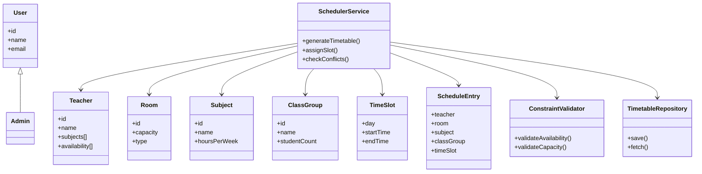

```mermaid
classDiagram

class User {
  +id
  +name
  +email
}

class Admin

User <|-- Admin

class Teacher {
  +id
  +name
  +subjects[]
  +availability[]
}

class Room {
  +id
  +capacity
  +type
}

class Subject {
  +id
  +name
  +hoursPerWeek
}

class ClassGroup {
  +id
  +name
  +studentCount
}

class TimeSlot {
  +day
  +startTime
  +endTime
}

class ScheduleEntry {
  +teacher
  +room
  +subject
  +classGroup
  +timeSlot
}

class SchedulerService {
  +generateTimetable()
  +assignSlot()
  +checkConflicts()
}

class ConstraintValidator {
  +validateAvailability()
  +validateCapacity()
}

class TimetableRepository {
  +save()
  +fetch()
}

SchedulerService --> Teacher
SchedulerService --> Room
SchedulerService --> Subject
SchedulerService --> ClassGroup
SchedulerService --> TimeSlot
SchedulerService --> ScheduleEntry
SchedulerService --> ConstraintValidator
SchedulerService --> TimetableRepository
```
