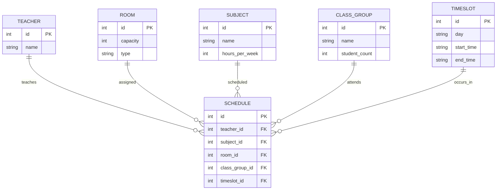

```mermaid
erDiagram

TEACHER {
  int id PK
  string name
}

ROOM {
  int id PK
  int capacity
  string type
}

SUBJECT {
  int id PK
  string name
  int hours_per_week
}

CLASS_GROUP {
  int id PK
  string name
  int student_count
}

TIMESLOT {
  int id PK
  string day
  string start_time
  string end_time
}

SCHEDULE {
  int id PK
  int teacher_id FK
  int subject_id FK
  int room_id FK
  int class_group_id FK
  int timeslot_id FK
}

TEACHER ||--o{ SCHEDULE : teaches
ROOM ||--o{ SCHEDULE : assigned
SUBJECT ||--o{ SCHEDULE : scheduled
CLASS_GROUP ||--o{ SCHEDULE : attends
TIMESLOT ||--o{ SCHEDULE : occurs_in
```
