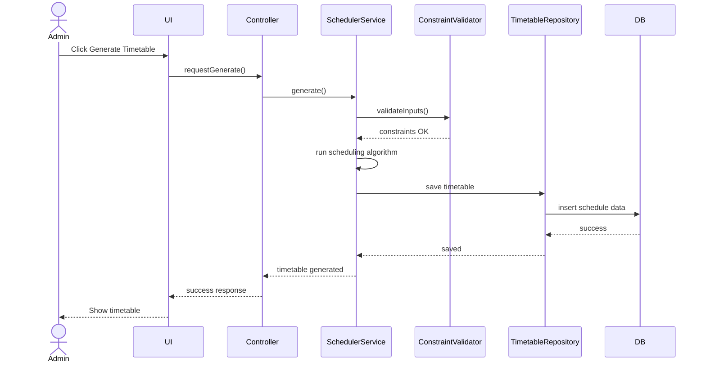

```mermaid
sequenceDiagram

actor Admin
participant UI
participant Controller
participant SchedulerService
participant ConstraintValidator
participant TimetableRepository
participant DB

Admin->>UI: Click Generate Timetable
UI->>Controller: requestGenerate()
Controller->>SchedulerService: generate()

SchedulerService->>ConstraintValidator: validateInputs()
ConstraintValidator-->>SchedulerService: constraints OK

SchedulerService->>SchedulerService: run scheduling algorithm

SchedulerService->>TimetableRepository: save timetable
TimetableRepository->>DB: insert schedule data
DB-->>TimetableRepository: success

TimetableRepository-->>SchedulerService: saved
SchedulerService-->>Controller: timetable generated
Controller-->>UI: success response
UI-->>Admin: Show timetable
```